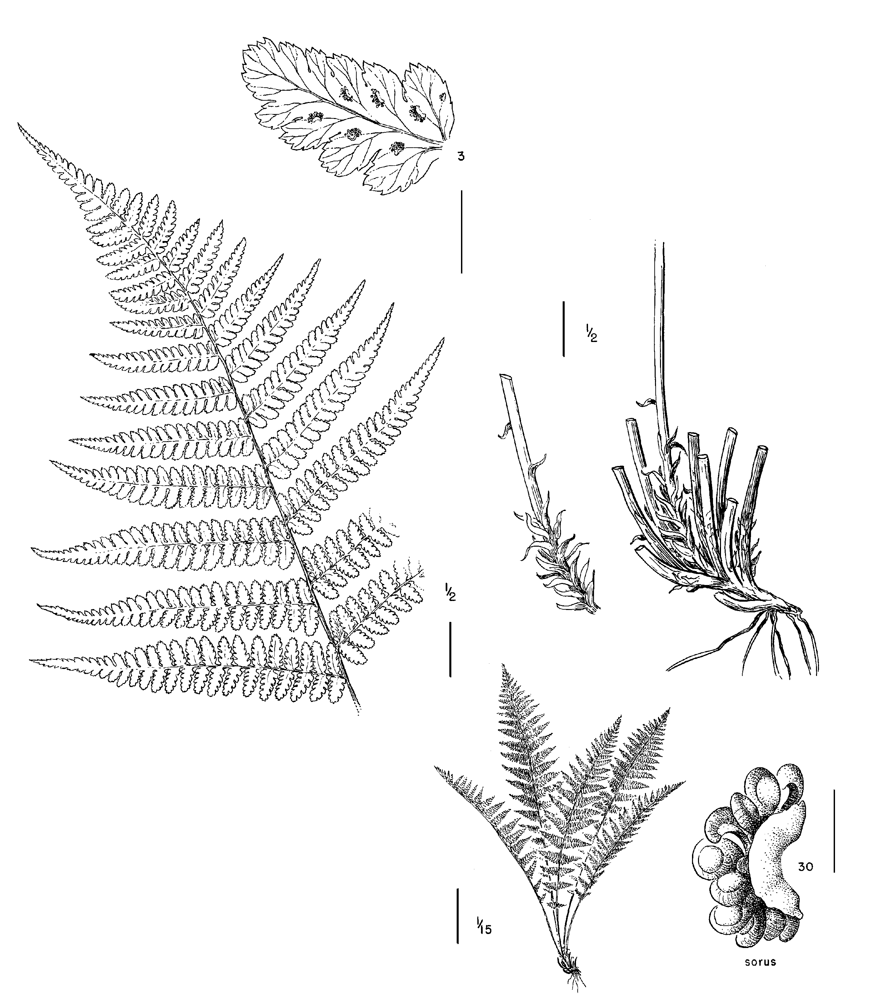

##### Question #1: 
For this exercise, use your newly-developed ggplot chops to create some nice graphs from your own data (If you do not have a good data frame to use for graphics, use one of the many built-in data frames from R (other than mpg, which we are using in class)). Experiment with different themes, theme base sizes, aesthetics, mappings, and faceting. When you are finished, try exporting them to high quality pdfs, jpgs, eps files, or other formats that you would use for submission to a journal.

* For this assignment I decided to use the Suissa et al 2021 data set of global fern occurrence data and bioclim variables. I extracted the taxa apart of the North America Athyrium filix-femina species complex that I hope to investigate for my dissertation. 

* Athyrium filix-femina is a cosmopolitan fern that is found throughout the northern hemisphere. In North America we have four different varieties of A. filix-femina: angustum, asplenioidies, californicum, and cyclosorum. 

<p align="center">

<p align="center">
##### Athyrum filix-femina var cyclosorum

* I also included two closely related taxa: Pseudathyrium alpestre (synonym= Athyrium americanum, Athyrium distentifolium var americanum) and Athryium acruatum (restricted to southern Mexico and South America). 

* This group is often cited in Floras (Flora North America, Flora of Mexico, etc..) as needing taxonomic revision and further investigation.

* While sequence and morphology data will be some of the most informative data sets for my research, I also hope in incorporate ecological variables to help understand if these varieties do indeed occupy different niche space in their environments. 

* In fern biogeography, mean annual temperature (C) and annual precipitation have become known as two of the most important variables for characterizing the niche and distribution of fern taxa. 

* In the following graphical analysis, I will investigate whether each of the varieties and the two outgroups segregate out into specific niche space when comparing the relationship between mean annual temperature and annual precipitation. 

##### First load and clean the data 
```{r, echo=TRUE}
#Preliminaries------------------
library(ggplot2)
library(ggridges)
library(ggforce)
library(ggthemes)
library(RColorBrewer)
library(ggpmisc)

# Read in the data 
athyrium_data <- read.csv("AthyriumNAmerica_MAT_MAP.csv") 


# clean the data of NAs 
# clean_athyrium_data <-athyrium_data[complete.cases(athyrium_data),]
clean_athyrium_data <-na.omit(athyrium_data) # different way of cleaning out NAs 

# Check the data
head(clean_athyrium_data)
```


##### Plot 1: simple plot with taxa identified by color 
```{r, echo=TRUE}
plot_1 <- ggplot(data=clean_athyrium_data, mapping=(aes(x=Annual_Mean_Temp_1,y=AnnualPrecipitation_1,color=Accepted_binomial))) + 
  geom_point(size=1) + xlab("Mean Annual Temperature (K)") + ylab("Annual Precipitation (mm)") + scale_color_brewer("Taxa")

print(plot_1)

#Save the plot as a pdf
ggsave("plot_1.pdf")
```

* Plot generated successfully and does show some interesting clustering of color right away. However, the colors make it difficult to see and there is a lot of overlap. It is also hard to takeout discreet groups of the taxa. 

##### Plot 2: lets change the colors and clean up the axes 
```{r, echo=TRUE}
plot_2 <- ggplot(data=clean_athyrium_data, mapping=(aes(x=Annual_Mean_Temp_1,y=AnnualPrecipitation_1,color=Accepted_binomial))) + 
  geom_point(size=1) + xlab("Mean Annual Temperature (K)") + ylab("Annual Precipitation (mm)") + scale_color_brewer(palette="RdYlGn", "Taxa") + theme_classic()

print(plot_2)

#Save the plot as a pdf
ggsave("plot_2.pdf")
```
* With a clean background and better contrast between colors it is much easier to start to see a pattern. There seems to be considerable overlap between taxa but some clustering into discreet temperature and percipitation niches. 


#### Plot 3: Add a linear model to deterime negative or postive relationships for mean annual temperature and annual precipitation for each taxa
```{r, echo=TRUE}
plot_3 <- ggplot(data=clean_athyrium_data, mapping=(aes(x=Annual_Mean_Temp_1,y=AnnualPrecipitation_1,color=Accepted_binomial))) + 
  geom_point(size=1) + xlab("Mean Annual Temperature (K)") + ylab("Annual Precipitation (mm)") + scale_color_brewer(palette="RdYlGn", name="Taxa") + theme_classic() + geom_smooth(method=lm) 

print(plot_3)

#Save the plot as a pdf
ggsave("plot_3.pdf")
```
* Regression lines from linear model on each taxa show some interesting and taxa specific relationships to the variables. The north american A. filix-femina var californicum, var cyclosorum and Pseudathyrium alpestre all have positive relationship to mean annual temperature and precipitation. Where the South American A. acruatum and southeastern North American A. filix-femina var aspelenioides have a negative relationship. One thing that is also noteworthy from this figure is that no two taxa occupy the same extact nich space when it comes to temperature and precipitation. 


#### Plot 4: Instead of displaying data with linear model lets group the taxa on the plot by drawing a hull around each. 
```{r, echo=TRUE}
plot_4 <- ggplot(data=clean_athyrium_data, mapping=(aes(x=Annual_Mean_Temp_1,y=AnnualPrecipitation_1))) + geom_point(size=1,aes(color=Accepted_binomial)) + xlab("Mean Annual Temperature (K)") + guides(color=FALSE) + ylab("Annual Precipitation (mm)") + geom_mark_hull(concavity= 5, expand = 0, radius=0, aes(fill=Accepted_binomial))

plot_4 

#Save the plot as a pdf
ggsave("plot_4.pdf")
```
* This plot has a lot to unpack. But does a really good job of showing but the niche overlap as well as taxa speicific niche space. The most distantly related taxa P. alpestre and Athyrium arcuatum do extend well out of the range of the other varieties. Many of the varieties over lap in this plot but var cyclosorum does extend into colder more seasonal areas far more that the rest. 

##### Plot 5: As there is considerable amount of overlap lets try to split up the taxa in a facet plot 
```{r, echo=TRUE}
plot_5 <- ggplot(data=clean_athyrium_data, mapping=(aes(x=Annual_Mean_Temp_1,y=AnnualPrecipitation_1,color=Accepted_binomial))) + 
  geom_point(size=1) + xlab("Mean Annual Temperature (K)") + ylab("Annual Precipitation (mm)") + guides(color=FALSE) + facet_grid(.~Accepted_binomial, scales = "fixed") +  theme(strip.text.x = element_text(size = 8))

plot_5

#Save the plot as a pdf
ggsave("plot_5.pdf")
```
* This facet plot does a good job of untageling the different taxa and showing their ranges with in this particular niche space. Intestingly, there is a uniform wide ranging pattern with the more high elevation Athyrium arcuatum, A. filix-femina var cyclosorum, and Pseudathyrium alpestre. This pattern is also reflected in the lower elevation A. filix-femina var angustum, asplenioides and californicum. 


##### Plot 6: To tease apart some of the variation we are seeing I will create density ridge of mean annual temperature to compare across taxa.
```{r, echo=TRUE}
plot_6 <- ggplot(clean_athyrium_data, aes(x=Annual_Mean_Temp_1, y=Accepted_binomial, fill=Accepted_binomial)) + geom_density_ridges() + theme(axis.title.y = element_blank()) + xlab("Mean Annual Temperature (C)") + scale_fill_discrete(name="Taxa") + guides(fill=FALSE) 

plot_6

#Save the plot as a pdf
ggsave("plot_6.pdf")
````
* I like this plot because it makes it easy to compare specifics differences between taxa with just one variable. In retrospect, this would be a useful plot to run on each of the variables before creatinig a scatter plot in order to visualize the variation between each taxa for each variable. 

##### Plot 7: I will do the same and create denisity ridges for annual precipitation across all taxa. 
```{r, echo=TRUE}
plot_7 <- ggplot(clean_athyrium_data, aes(x=AnnualPrecipitation_1, y=Accepted_binomial, fill=Accepted_binomial)) + geom_density_ridges() + theme(axis.title.y = element_blank()) + xlab("Annual Precipitation (mm)")  + scale_fill_discrete(name="Taxa") + guides(fill=FALSE) 

plot_7

#Save the plot as a pdf
ggsave("plot_7.pdf")
````
* Again useful as a different pattern emerges between taxa which overlap in their ranges (var californicum and var cyclosorum) and those which are presumed to be restricted to various regions of North America such as var asplenioides is to the southeastern United States. Var californicum seems to be one of the 5 that is only found in dry places with high temperatures. 
